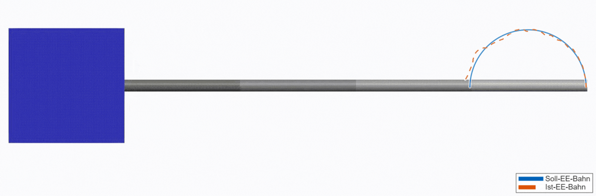
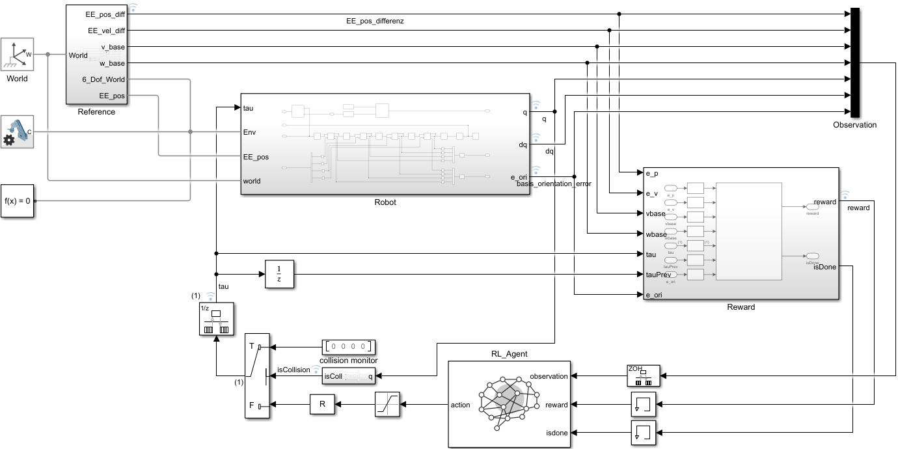
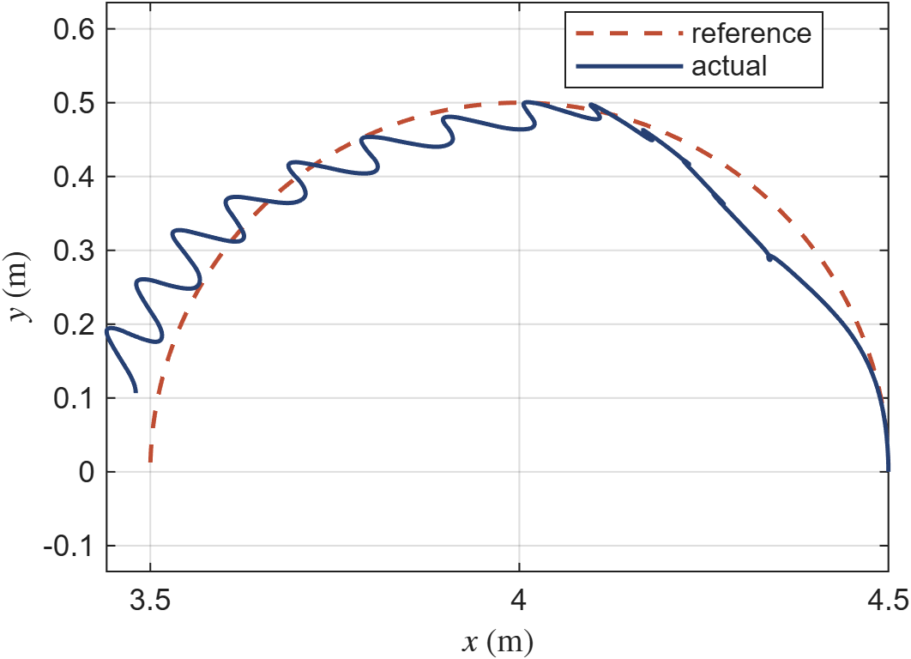
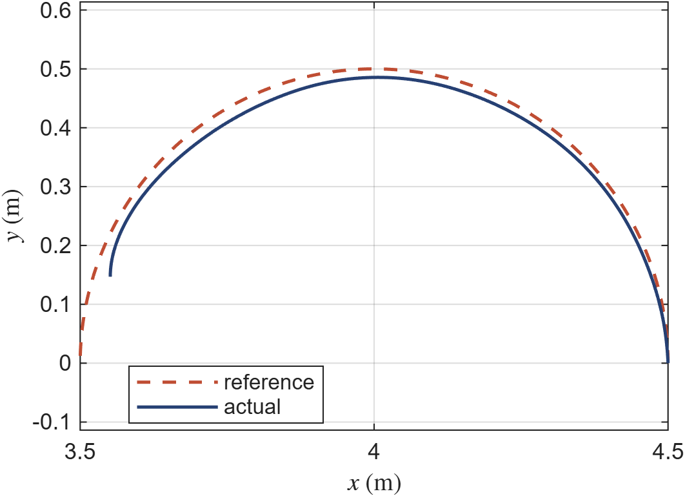
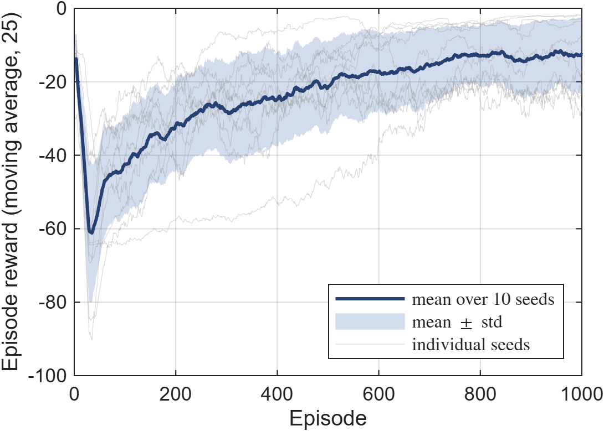
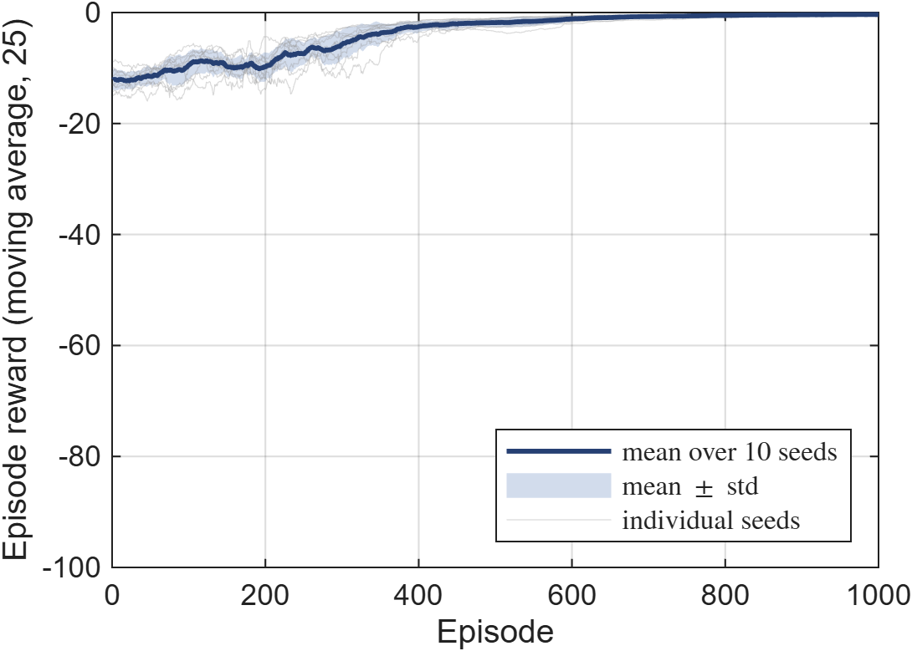

# Benchmarking Deep Reinforcement Learning for Free-Floating Space Robot Control

**Comparative evaluation of six deep RL algorithms for Cartesian path tracking of a free-floating space manipulator, with integrated formal safety monitoring.**

---

## Overview

This project investigates the use of continuous-action deep reinforcement learning (RL) to control a free-floating space robot manipulator. A 4-DOF robotic arm mounted on an unactuated spacecraft base must track a desired end-effector trajectory while minimizing base attitude disturbance — a fundamental challenge in on-orbit servicing caused by the dynamic coupling between manipulator motion and base reaction (conservation of angular momentum).


*Result of the optimized PPO agent controlling the free-floating space robot. The animation displays the robot's configuration during circular trajectory tracking, with superimposed reference (desired) and actual end-effector paths.*

Six state-of-the-art RL algorithms are benchmarked under unified conditions:

| Algorithm | Type | Policy |
|-----------|------|--------|
| **PPO** (Proximal Policy Optimization) | On-policy | Stochastic |
| **TRPO** (Trust Region Policy Optimization) | On-policy | Stochastic |
| **PG** (Policy Gradient / REINFORCE) | On-policy | Stochastic |
| **DDPG** (Deep Deterministic Policy Gradient) | Off-policy | Deterministic |
| **TD3** (Twin Delayed DDPG) | Off-policy | Deterministic |
| **SAC** (Soft Actor-Critic) | Off-policy | Stochastic |

**PPO** emerges as the top performer and is further optimized through systematic hyperparameter tuning and network architecture refinement, achieving an **80.7% improvement in mean episodic return**, **67.7% reduction in tracking error**, and **zero safety violations**.

## Background & Motivation

Free-floating space robots operate in microgravity with their thrusters turned off. Unlike terrestrial robots with a fixed base, any manipulator motion causes the spacecraft base to rotate and translate due to momentum conservation. This makes end-effector trajectory tracking significantly more challenging:

- **Dynamic coupling**: Arm motions induce base attitude disturbance, which in turn shifts the end-effector away from the target
- **No external forces**: The base cannot be stabilized by thrusters (to conserve fuel and avoid exciting structural dynamics)
- **Traditional control limitations**: Model-based approaches struggle with uncertainties and unmodeled dynamics
- **Data scarcity**: Supervised learning is impractical due to limited labeled data from actual space operations

Reinforcement learning offers a trial-and-error approach that can learn control policies directly from simulation interaction, without requiring an accurate analytical model. Combined with a high-fidelity physics simulation and formal safety verification, this enables developing robust controllers for safety-critical space applications.

## Key Contributions

1. **Systematic RL algorithm comparison** — Six continuous-action RL algorithms evaluated on the same task under identical conditions, filling a gap in the space robotics literature where most studies focus on a single algorithm
2. **Formal safety integration** — Collision monitoring, momentum conservation verification, joint limit enforcement, and formal torque constraint verification (via Simulink Design Verifier) embedded directly in the training loop
3. **High-fidelity simulation** — MATLAB/Simulink environment using Simscape Multibody with URDF-based robot model, zero-gravity dynamics, and realistic sensor/actuator modeling
4. **PPO optimization** — Systematic tuning of neural network architecture (3 hidden layers: 256-256-128) and hyperparameters, yielding significant improvements across all performance metrics

## System Architecture

### Robot Model

The robot consists of a cuboid spacecraft base with a 4-DOF serial manipulator arm. The kinematic and inertial properties are defined in a URDF file (`SpaceRobot.urdf`) and imported into Simulink's Simscape Multibody environment. The base is connected to the world frame through an unactuated 6-DOF joint, allowing free translation and rotation. Gravity is set to zero to emulate the orbital microgravity environment.

<p align="center">
  
  <br/>
  <em>Overview of the Simulink closed-loop simulation framework integrating robot dynamics, RL agent, reward computation, and safety monitoring.</em>
</p>

### Observation Space (23 dimensions)

| Component | Dimensions | Description |
|-----------|:----------:|-------------|
| End-effector position error | 3 | Cartesian tracking error |
| End-effector velocity error | 3 | Velocity tracking error |
| Joint positions | 4 | Arm configuration (rad) |
| Joint velocities | 4 | Arm motion state (rad/s) |
| Base orientation error | 3 | Attitude deviation |
| Base angular velocity | 3 | Rotational disturbance (rad/s) |
| Base linear velocity | 3 | Translational disturbance (m/s) |

### Action Space (4 dimensions)

Continuous joint torques for the 4 revolute joints, clipped to [-tau_max, +tau_max].

### Reward Function

The reward at each timestep combines a progress term, a proximity bonus, and a weighted cost:

```
r_t = (1/C) * (r_progress + r_bonus - cost)
```

The cost penalizes:
- End-effector position error (W_p = 150)
- End-effector velocity error (W_v = 25)
- Base orientation error (W_ori = 200)
- Base angular velocity (W_wb = 8)
- Base linear velocity (W_vb = 2)
- Joint torque magnitude (W_u = 0.02)
- Torque rate / smoothness (W_d = 0.06)

High weights on tracking and base orientation drive the agent toward accurate, disturbance-minimizing behavior.

### Safety Monitors

- **Collision Monitor**: Computes distances between robot components; triggers emergency stop and episode termination if distance falls below safety threshold
- **Joint Limit Enforcement**: Assertion blocks monitor joint angles; exceeding limits triggers torque cutoff and episode termination with penalty
- **Momentum Conservation Monitor**: Continuously verifies that total system momentum remains near zero (within ~10^-6 Ns), confirming physical consistency
- **Formal Torque Verification**: Simulink Design Verifier (SLDV) formally proves that the trained policy cannot command out-of-bounds torques for *any* possible input state

## Results

### Algorithm Comparison (30 evaluation episodes each)

| KPI | TRPO | TD3 | SAC | **PPO** | PG | DDPG |
|-----|:----:|:---:|:---:|:-------:|:--:|:----:|
| **K2**: Mean Squared EE Error | 0.0680 | 0.1914 | 0.1908 | **0.0257** | 0.1638 | 0.0937 |
| **K3**: Max EE Error | 0.6783 | 0.5341 | 0.7766 | 0.4833 | 1.0654 | **0.4758** |
| **K4**: Mean Base Orientation Error | 0.0694 | 0.0868 | 0.1687 | **0.0667** | 0.1302 | 0.2682 |
| **K7**: Control Smoothness (jerk) | 0.7498 | 0.9981 | 0.7536 | **0.6812** | 0.7125 | 0.8118 |
| **T1**: Reward Std (stability) | **0.6144** | 8.5168 | 9.6907 | 1.7756 | 13.1970 | 64.4764 |
| **T3**: Training Time (1000 eps) | ~13 min | ~38 min | ~35 min | **~8 min** | ~8 min | ~24 min |

PPO achieves the best tracking accuracy (K2), base stability (K4), smoothest control (K7), and fastest training time — making it the clear overall winner.

### Optimized PPO Performance (Circular Trajectory)

| Metric | PPO (Default) | PPO (Optimized) | Improvement |
|--------|:------------:|:---------------:|:-----------:|
| Mean Episodic Reward (K1) | -2.23 | **-0.43** | +80.7% |
| Mean Squared EE Error (K2) | 0.0257 | **0.0083** | -67.7% |
| Max EE Error (K3) | 0.4833 | **0.27** | -44.1% |
| Base Orientation Error (K4) | 0.0667 | **0.022** | -67.0% |
| Collision Rate (K5) | 0 | **0** | -- |
| Joint Limit Violations (K6) | 5.1% | **0%** | -100% |
| Torque Smoothness (K7) | 0.6812 | **0.351** | -48.5% |
| Energy Consumption (K9) | 6.325 | **5.314** | -16.0% |

The optimized PPO also generalizes to piecewise-linear (ramp) trajectories, reducing base disturbance by 44% and energy consumption by 35% compared to the default configuration.

#### End-Effector Trajectory: Default vs. Optimized PPO

<p align="center">
  
  
  <br/>
  <em>Left: Default PPO — significant deviation and oscillations. Right: Optimized PPO — closely follows the reference circle.</em>
</p>

#### Training Curves: Default vs. Optimized PPO

<p align="center">
  
  
  <br/>
  <em>Left: Default PPO — plateaus early with high variance. Right: Optimized PPO — faster convergence and higher reward.</em>
</p>

## Project Structure

```
space-robot-rl/
|
|-- SpaceRobot.slx                  # Main Simulink model (robot + RL environment)
|-- SpaceRobot.urdf                 # Robot description (kinematics & inertia)
|-- startup.m                       # Run once per session: sets MATLAB path (Root + src/)
|
|-- src/
|   |-- bo/                         # Bayesian hyperparameter optimization
|   |   |-- bo.m                    #   Launcher (choose agentType)
|   |   |-- optimizeAgent.m         #   Driver: parallel pool + trials + pre-flight + saving
|   |   |-- runAllOptimizations.m   #   Optimize several agent types in sequence
|   |   |-- getSearchSpace.m        #   Search space per agent type
|   |   |-- buildAgent.m            #   Build an agent with the correct options per type
|   |   |-- trainAndEvaluate.m      #   bayesopt objective (train + deterministic eval)
|   |   |-- checkBuildAgents.m      #   Fast build check for all 6 agents (no Simulink)
|   |   |-- saveBOState.m           #   bayesopt checkpoint output function
|   |   `-- diagnoseBOErrors.m      #   Dump real per-trial errors from a saved BO run
|   |-- env/                        # Simulink environment glue
|   |   |-- setupSpaceRobotEnv.m    #   Worker-safe environment builder
|   |   |-- localResetFunction.m    #   Episode reset function (env.ResetFcn)
|   |   `-- collisionCheckWrapper.m #   Collision check called by the model at runtime
|   |-- training/
|   |   |-- SpaceRobotDynamic.m     #   Interactive training script (choose agentType)
|   |   `-- perAgent/               #   Per-agent training variants (PG/PPO/TRPO/DDPG/TD3/SAC)
|   |-- kpi/                        # Evaluation
|   |   |-- calculate_kpi.m         #   Run a trained agent & compute KPIs
|   |   |-- calculate_kpi_statistik.m #  KPI statistics across agents
|   |   `-- computeKPIsFromLogs.m   #   Compute 9 KPIs from simulation logs
|   `-- utils/                      # KreisbahnSR.m (trajectory/IK), checksUnits.m
|
|-- models/                        # verify_reward.slx, verify_tau.slx (verification harnesses)
|-- SavedAgents/                   # Trained agents + BO results (Circular/Linear x Default/Optimized/BO)
|-- Figures/                       # Figures for the report/README (videos/ subfolder for .avi)
|-- legacy/                        # Unused / experimental scripts (SPART tutorials)
|-- backup/                        # Model backups (.slx.original / .r2025b)
`-- _personal/                     # Non-project personal files
```

## Getting Started

### Requirements

| Toolbox | Required | Notes |
|---------|:--------:|-------|
| MATLAB | R2025b or later | Core environment |
| Simulink | R2025b or later | Simulation framework |
| Simscape Multibody | R2025b or later | Physics-based robot dynamics |
| Reinforcement Learning Toolbox | R2025b or later | RL agent creation, training, and evaluation |
| Simulink Design Verifier | R2025b or later | Formal torque verification only (optional) |

> **Set up the path first.** Open MATLAB with the project root as the current folder and run
> `startup` once per session. This adds the root and all `src/` subfolders to the MATLAB path.
> The two main entry scripts (`bo.m`, `SpaceRobotDynamic.m`) also call `startup` automatically.

### Training an Agent

1. Open MATLAB, set the current folder to the project root, and run `startup`.
2. Run the interactive training script and pick the algorithm via the `agentType` variable:
```matlab
SpaceRobotDynamic      % edit agentType = "PPO" | "TRPO" | "PG" | "DDPG" | "TD3" | "SAC"
```
The script will
   - Load the robot model (`SpaceRobot.urdf`)
   - Open the Simulink environment (`SpaceRobot.slx`)
   - Build the agent with its best hyperparameters and train for 1000 episodes
   - Save the trained agent to a `.mat` file

Per-agent variants are also available under `src/training/perAgent/` (e.g. `PPO`, `TRPO`).

### Hyperparameter Optimization (Bayesian)

```matlab
bo                     % edit agentType inside bo.m; results go to SavedAgents/Circular/BO/
```
`optimizeAgent` runs a parallel Bayesian search with a fast pre-flight check; failed trials are
logged to `<runDir>/trial_errors.log`. Inspect a finished/aborted run with `diagnoseBOErrors`.

### Using a Pre-Trained Agent

Trained agents are stored under `SavedAgents/` and can be loaded directly:

```matlab
% Load a pre-trained PPO agent
agent = load('SavedAgents/Circular/Default/PPO.mat').agent;

% Simulate the agent in the Simulink environment
simOut = sim('SpaceRobot');
```

### Evaluating a Trained Agent

```matlab
calculate_kpi
```

This loads a pre-trained agent, runs evaluation episodes, and computes the 9 KPIs (tracking error, base disturbance, collisions, energy consumption, etc.).

### Simulation Parameters

| Parameter | Value |
|-----------|-------|
| Simulation timestep | 0.01 s |
| Agent decision interval | 0.1 s |
| Episode duration | 8.5 s (~85 agent steps) |
| Circular trajectory radius | 0.4 m |
| Training episodes | 1000 |
| Evaluation episodes | 30 |

## Citation

If you use this work in your research, please cite:

```bibtex
@article{ermisch2025benchmarking,
  title={Benchmarking Deep Reinforcement Learning for Cartesian Path Tracking
         of Free-Floating Space Robot Manipulators},
  author={Ermisch, Patrick S. and Kaigom, Eric Guiffo},
  journal={IEEE Access},
  year={2025},
  publisher={IEEE}
}
```

## Author

**Patrick S. Ermisch**
Department of Computer Science & Engineering, Frankfurt University of Applied Sciences, Germany

## License

[](https://creativecommons.org/licenses/by-nd/4.0/)

This work is licensed under a [Creative Commons Attribution-NoDerivatives 4.0 International License](https://creativecommons.org/licenses/by-nd/4.0/). You are free to share and use this project (including commercially), but you may not distribute modified versions. Attribution is required.
