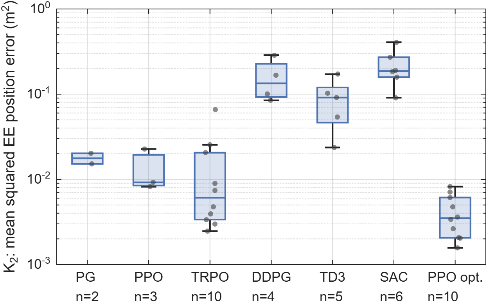

# Benchmarking Deep Reinforcement Learning for Free-Floating Space Robot Control

**Comparative evaluation of six deep RL algorithms for Cartesian path tracking of a free-floating space manipulator in MATLAB/Simulink, with runtime safety monitors and an offline torque-bound check.**

---

## Overview

This project investigates continuous-action deep reinforcement learning (RL) for controlling a free-floating space robot manipulator. A 4-DOF arm mounted on an unactuated spacecraft base must track a desired end-effector trajectory while keeping the base attitude disturbance small. The difficulty comes from the dynamic coupling between arm and base: with the thrusters off, every arm motion rotates and translates the base because momentum is conserved.


*Optimized PPO agent controlling the free-floating space robot on the circular trajectory, with reference and actual end-effector paths. The animation was recorded with an earlier version of the model (before the mass correction described below).*

Six RL algorithms from the MATLAB Reinforcement Learning Toolbox are benchmarked under identical conditions:

| Algorithm | Type | Policy |
|-----------|------|--------|
| **PPO** (Proximal Policy Optimization) | On-policy | Stochastic |
| **TRPO** (Trust Region Policy Optimization) | On-policy | Stochastic |
| **PG** (Policy Gradient / REINFORCE) | On-policy | Stochastic |
| **DDPG** (Deep Deterministic Policy Gradient) | Off-policy | Deterministic |
| **TD3** (Twin Delayed DDPG) | Off-policy | Deterministic |
| **SAC** (Soft Actor-Critic) | Off-policy | Stochastic |

All six agents are trained with the MATLAB default hyperparameters, and PPO additionally with an optimized configuration found by Bayesian optimization. Each configuration is trained with **10 seeds** (70 runs of 1000 episodes).

**Main result.** With default hyperparameters, only **TRPO** completed all ten runs without a terminated evaluation episode. The other default agents aborted 40 to 80 % of their evaluation episodes because of joint-limit violations or contacts. The **optimized PPO** agent also completed all ten runs and reached the lowest mean squared tracking error (K2 = 0.0041 compared with 0.0145 for TRPO). On the seed level, this difference was not significant (Mann–Whitney, p = 0.089). Only the difference in the base orientation error reached the 5 % level (p = 0.045).

## Background & Motivation

Free-floating space robots operate in microgravity with their thrusters turned off. Unlike terrestrial robots with a fixed base, any manipulator motion moves the spacecraft base. This makes end-effector trajectory tracking harder:

- **Dynamic coupling**: arm motions induce base attitude disturbance, which in turn shifts the end-effector away from the target
- **No external forces**: the base is not stabilized by thrusters (to conserve fuel and avoid exciting structural dynamics)
- **Model-based control**: depends on accurate inertial parameters, which are uncertain in practice
- **Data scarcity**: labeled data from actual space operations is limited

RL learns a control policy from interaction with a simulation. This project uses a Simscape Multibody model and compares how reliably different RL algorithms learn such a policy under the same conditions.

## Key Contributions

1. **Systematic RL algorithm comparison**: six continuous-action RL algorithms evaluated on the same task under identical conditions, with 10 seeds per configuration and a separate report of robustness (abort rate over all runs) and performance (KPIs over the successful runs)
2. **Safety monitoring**: runtime monitors for collisions and joint limits that terminate the episode, a momentum monitor as a physical consistency check, and an offline torque-bound check with Simulink Design Verifier on a simplified model
3. **Simulation environment**: MATLAB/Simulink environment with a URDF-based Simscape Multibody model and zero gravity, with optional sensor noise, joint disturbance torques, reduced torque limits, and scaled inertial parameters for stress tests
4. **PPO optimization and further studies**: optimized PPO configuration (actor and critic with 2 × 128 ReLU units, tuned learning rates and PPO settings), reward ablation, reward sensitivity, stress tests, and a second reference path

## System Architecture

### Robot Model

The robot consists of a cuboid spacecraft base with a 4-DOF serial manipulator arm. The kinematic and inertial properties are defined in `SpaceRobot.urdf` and imported into Simscape Multibody. The base is connected to the world frame through an unactuated 6-DOF joint, which allows free translation and rotation. Gravity is set to zero.

| Body | Mass | Principal moments of inertia |
|------|:----:|:----------------------------:|
| Base | 30 kg | 6 kg m² |
| Each arm link | 2 kg | 0.2 kg m² (about the center of mass) |

These are the totals of each body. In the Simulink model, part of the mass sits in the visual geometry blocks, so `setupSpaceRobotEnv` splits the totals between the inertia and the geometry blocks (`benchmarkConfig`, `cfg.version = 2`). Agent files of the earlier configuration are converted by `upgradeConfig`.

<p align="center">
  
  <br/>
  <em>Overview of the Simulink closed-loop simulation with robot dynamics, RL agent, reward computation, and safety monitoring (screenshot of an earlier model version).</em>
</p>

### Observation Space (23 dimensions)

| Component | Dimensions | Description |
|-----------|:----------:|-------------|
| End-effector position error | 3 | Cartesian tracking error (m) |
| End-effector velocity error | 3 | Velocity tracking error (m/s) |
| Base linear velocity | 3 | Translational disturbance (m/s) |
| Base angular velocity | 3 | Rotational disturbance (rad/s) |
| Joint positions | 4 | Arm configuration (rad) |
| Joint velocities | 4 | Arm motion (rad/s) |
| Base orientation error | 3 | Attitude deviation |

### Action Space (4 dimensions)

Continuous joint torques for the four revolute joints, limited to ±τ_max = ±2 N m.

### Reward Function

The reward at each step combines a progress term, a proximity bonus, and a weighted cost:

```
r_t = (1/C) * (r_progress + r_bonus - cost),   C = 500
```

The cost penalizes:
- End-effector position error (W_p = 150)
- End-effector velocity error (W_v = 25)
- Base orientation error (W_ori = 200)
- Base angular velocity (W_wb = 8)
- Base linear velocity (W_vb = 2)
- Joint torque magnitude (W_u = 0.02)
- Torque rate (W_d = 0.06)

An episode is terminated early on a contact, a joint-limit violation, an end-effector error above 10 m, or a NaN/Inf value. The agent then receives −1 for the terminal step and for every remaining step, r_fail = −(N − k + 1) with N = 85.

### Safety Monitors

- **Collision monitor**: computes the minimum distance between non-adjacent bodies from the URDF collision geometry at every agent step. Below d_safe = 2 cm, a warning is raised and logged. On a detected contact, all joint torques are set to zero and the episode is terminated.
- **Joint limits**: joint 1 is limited to ±85°, joints 2 to 4 to ±170°. A violation terminates the episode with the penalty above.
- **Momentum monitor**: logs the total linear momentum of the system as a physical consistency check. For TRPO and the optimized PPO agent it remained below 10⁻⁶ N s in all evaluation episodes, the other agents reached up to 4.3 × 10⁻⁴ N s.
- **Torque-bound check (offline)**: Simulink Design Verifier found no counterexample for the property |τ_i| ≤ τ_max on a simplified verification model (`models/verify_tau.slx`), in which the plant is replaced by a worst-case abstraction.

The runtime monitors detect violations and terminate the episode, they do not prove their absence. Closed-loop stability, task completion, and collision avoidance of the full Simscape model are not formally verified.

## Results

All values are from `results/benchmark_v2/analysis` (circular trajectory, nominal conditions). Each trained agent is evaluated deterministically on 31 episodes, one from the nominal initial pose and 30 from random initial joint angles within ±1°. A run (one seed) counts as **successful** if none of its 31 evaluation episodes is terminated.

### Robustness (all 10 runs per configuration)

| Configuration | Successful runs | Abort rate |
|---------------|:---------------:|:----------:|
| **TRPO** | **10/10** | **0.0 %** |
| SAC | 6/10 | 40.0 % |
| TD3 | 5/10 | 48.4 % |
| DDPG | 4/10 | 51.6 % |
| PPO | 3/10 | 70.0 % |
| PG | 2/10 | 80.0 % |
| **PPO (optimized)** | **10/10** | **0.0 %** |

### Performance (mean ± std over the successful runs)

| Configuration | Runs | K2: Mean squared EE error | K4: Mean base orientation error | T2: Training time (min) |
|---------------|:----:|:-------------------------:|:-------------------------------:|:-----------------------:|
| TRPO | 10 | 0.0145 ± 0.0196 | 0.026 ± 0.009 | 11.3 ± 0.7 |
| SAC | 6 | 0.2168 ± 0.1098 | 0.145 ± 0.092 | 35.2 ± 0.4 |
| TD3 | 5 | 0.0886 ± 0.0560 | 0.098 ± 0.080 | 29.1 ± 1.4 |
| DDPG | 4 | 0.1599 ± 0.0919 | 0.353 ± 0.171 | 24.3 ± 0.2 |
| PPO | 3 | 0.0134 ± 0.0081 | 0.050 ± 0.014 | 8.4 ± 0.7 |
| PG | 2 | 0.0177 ± 0.0036 | 0.030 ± 0.011 | 6.9 ± 1.3 |
| **PPO (optimized)** | 10 | **0.0041 ± 0.0023** | **0.021 ± 0.016** | 9.2 ± 0.6 |

The KPI values are conditional on a successful run, so configurations with few successful runs are compared on a small sample. All nine KPIs and the statistical tests (Mann–Whitney on the seed level, Fisher's exact test for abort rates, Holm correction) are in `nominal_table2_full.csv`, `nominal_tests_kpi.csv`, and `nominal_tests_abort.csv`.

<p align="center">
  
  <br/>
  <em>Mean squared end-effector position error K2 of the successful runs of each configuration.</em>
</p>

### Further Studies

- **Stress tests** (all 70 agents without retraining): sensor noise (std 0.005), torque limits reduced to 75 % and 30 %, a disturbance torque of 2 N m on joints 1 and 2 for 0.5 s, masses, inertias, and joint damping scaled by 1.5, and all perturbations combined. TRPO and the optimized PPO agent completed all runs under every condition.
- **Piecewise-linear trajectory** (default PPO, optimized PPO, and TRPO retrained with 10 seeds, same hyperparameters and reward weights): the optimized PPO agent and TRPO completed all ten runs, the default PPO agent one. The optimized agent tracked the path more accurately than TRPO (K2 = 0.0059 compared with 0.0125, Mann–Whitney, p = 0.038).
- **Reward ablation and sensitivity** (5 seeds per variant): W_p and W_ori have the largest effect. The order of TRPO, PPO, and SAC by K2 did not change when these weights were halved or doubled. Results are in `results/analysis_partC/`.

#### End-Effector Trajectory: Default vs. Optimized PPO

<p align="center">
  
  
  <br/>
  <em>Reference and actual end-effector path in the XY plane from the nominal initial pose. Each panel shows the successful run with the median K2 of its configuration. Left: default PPO (seed 2). Right: optimized PPO (seed 0).</em>
</p>

#### Training Curves: Default vs. Optimized PPO

<p align="center">
  
  
  <br/>
  <em>Episode rewards over ten seeds (moving average over 25 episodes per seed, mean over the seeds, and ± one standard deviation). Left: default PPO. Right: optimized PPO.</em>
</p>

## Project Structure

```
space-robot-rl/
|
|-- SpaceRobot.slx                  # Main Simulink model (robot + RL environment + monitors)
|-- SpaceRobot.urdf                 # Robot description (kinematics & inertia)
|-- startup.m                       # Run once per session: sets MATLAB path (root + src/)
|
|-- src/
|   |-- env/                        # Environment and configuration
|   |   |-- benchmarkConfig.m       #   All parameters of an experiment (single source of truth)
|   |   |-- setupSpaceRobotEnv.m    #   Worker-safe environment builder (writes the model parameters)
|   |   |-- referenceTrajectory.m   #   Circular and piecewise-linear reference
|   |   |-- localResetFunction.m    #   Episode reset (initial state, sensor noise)
|   |   |-- upgradeConfig.m         #   Converts configurations of older agent files
|   |   `-- collisionCheckWrapper.m #   Collision check called by the model at runtime
|   |-- training/
|   |   |-- runBenchmark.m          #   Main benchmark: 7 configurations x 10 seeds, then evaluation
|   |   |-- runPartC.m              #   Stress tests, second path, ablation, sensitivity
|   |   |-- partCJobs.m             #   Job and evaluation lists of these studies
|   |   |-- runCampaign.m           #   Parallel training of a job list (resumable)
|   |   |-- trainOne.m              #   Trains and saves one agent (one seed)
|   |   |-- buildBenchmarkAgent.m   #   Default and optimized agent configurations
|   |   |-- campaignStatus.m        #   Progress and remaining time of a campaign
|   |   |-- progressLogger.m        #   Per-episode progress file during training
|   |   |-- appendRunLog.m          #   Row in runs.csv per finished run
|   |   |-- SpaceRobotDynamic.m     #   Earlier interactive training script (2025)
|   |   `-- perAgent/               #   Earlier per-agent training scripts (2025)
|   |-- kpi/                        # Evaluation
|   |   |-- evaluateAgent.m         #   Deterministic evaluation of one agent (through the RL environment)
|   |   |-- evaluateCampaign.m      #   Evaluates all agents of a campaign on the same initial states
|   |   |-- evalInitStates.m        #   Fixed random initial states for evaluation
|   |   |-- computeKPIsFromLogs.m   #   K1-K9 from the simulation logs
|   |   |-- analyzeBenchmark.m      #   Robustness and performance tables, statistical tests
|   |   |-- analyzeVariants.m       #   Comparison of several campaigns (ablation, sensitivity)
|   |   |-- makeFigures.m           #   Regenerates all data-driven figures of the paper
|   |   |-- calculate_kpi.m         #   Earlier interactive evaluation script (2025)
|   |   `-- calculate_kpi_statistik.m # Earlier KPI statistics script (2025)
|   |-- bo/                         # Bayesian hyperparameter optimization (used in 2025 for the optimized PPO)
|   `-- utils/                      # parametrizeSpaceRobotModel, prepareWorker, runMeta, KreisbahnSR, checksUnits
|
|-- results/                        # One folder per campaign (benchmark_v2, twoseg, abl_*, sens_*, r24b_*)
|   `-- <campaign>/
|       |-- agents/                 #   Trained agents <AGENT>_<mode>_s<seed>.mat (with cfg, stats, meta)
|       |-- eval/                   #   <condition>.csv, one row per agent and evaluation episode
|       |-- analysis/               #   Tables (CSV and LaTeX) and test results
|       |-- progress/               #   Per-episode training progress (local only, not versioned)
|       |-- runs.csv                #   Wall-clock time of each run
|       `-- campaign.mat            #   Job list
|   `-- analysis_partC/             # Ablation, sensitivity, and ranking tables
|
|-- models/                         # verify_reward.slx, verify_tau.slx (verification models)
|-- SavedAgents/                    # Agents and BO results of the 2025 study (earlier model version)
`-- Figures/                        # Figures for the README
```

Each agent file stores the full configuration, the training statistics, the Git commit, and a checksum of the model, so every result can be traced to the code that produced it.

## Getting Started

### Requirements

| Product | Required | Notes |
|---------|:--------:|-------|
| MATLAB, Simulink | R2026a | Results were produced with R2026a |
| Simscape Multibody | yes | Robot dynamics |
| Reinforcement Learning Toolbox | yes | Agents, training, environment |
| Parallel Computing Toolbox | yes | Parallel training and evaluation (`Workers = 0` runs serially) |
| Statistics and Machine Learning Toolbox | yes | Statistical tests, box plots, Bayesian optimization |
| Robotics System Toolbox | yes | URDF import and collision check |
| Simulink Design Verifier | optional | Offline torque-bound check only |

> **Set up the path first.** Open MATLAB with the project root as the current folder and run
> `startup` once per session. This adds the root and all `src/` subfolders to the MATLAB path.

### Reproducing the Results

```matlab
startup
runBenchmark      % main benchmark: 70 training runs + evaluation + analysis
runPartC          % stress tests, piecewise-linear path, ablation, sensitivity
```

Both scripts are resumable. Finished runs and existing evaluation files are skipped, so after an interruption the same call continues where it stopped. The 70 training runs of the main benchmark add up to about 21 h, or about 3.5 h with 6 parallel workers.

Progress can be checked from a second MATLAB session:

```matlab
startup
campaignStatus("benchmark_v2")
```

### Analysis and Figures

```matlab
R = analyzeBenchmark("benchmark_v2");                          % nominal conditions
R = analyzeBenchmark("benchmark_v2", Condition="noise");       % one stress test
T = analyzeVariants(["abl_wp0","abl_wori0"], ["W_p = 0","W_ori = 0"], Seeds=0:4);
makeFigures(OutDir="Figures/new")                              % all data-driven figures
```

### Training and Evaluating a Single Agent

```matlab
f = trainOne("PPO", "optimized", 0, Campaign="test");          % results/test/agents/PPO_optimized_s0.mat
Q = [zeros(4,1), evalInitStates(30, 1.0, 2026)];               % nominal pose + 30 random initial states
T = evaluateAgent(f, Q);                                       % one row per episode with K1-K9
T = evaluateAgent(f, Q, Condition="reduced_sat", Config=struct('tau_sat_scale', 0.75));
```

Evaluation runs through the RL environment. A plain `sim('SpaceRobot')` ignores the isDone signal and would not terminate an episode on a contact or joint-limit violation.

### Simulation Parameters

| Parameter | Value |
|-----------|-------|
| Solver step (fixed-step, ode4) | 0.01 s |
| Agent decision interval | 0.1 s |
| Episode duration | 8.5 s (85 agent steps) |
| Circular trajectory radius | 0.5 m |
| Torque limit τ_max | 2 N m |
| Collision threshold d_safe | 2 cm |
| Training episodes per run | 1000 |
| Seeds per configuration | 10 (5 for ablation and sensitivity) |
| Evaluation episodes per run | 31 (1 nominal + 30 random within ±1°) |

All parameters are set in `benchmarkConfig`. Individual values can be overridden, for example `benchmarkConfig('traj', "linear", 'reward.wori', 400)`.

## Citation

The paper is currently under review. If you use this work, please cite:

```bibtex
@unpublished{ermisch2026benchmarking,
  title  = {Benchmarking Deep Reinforcement Learning for Cartesian Path Tracking
            of Free-Floating Space Robot Manipulators},
  author = {Ermisch, Patrick S. and Kaigom, Eric Guiffo},
  note   = {Under review},
  year   = {2026}
}
```

## Author

**Patrick S. Ermisch**
Department of Computer Science & Engineering, Frankfurt University of Applied Sciences, Germany

## License

[](https://creativecommons.org/licenses/by-nd/4.0/)

This work is licensed under a [Creative Commons Attribution-NoDerivatives 4.0 International License](https://creativecommons.org/licenses/by-nd/4.0/). You are free to share and use this project (including commercially), but you may not distribute modified versions. Attribution is required.
